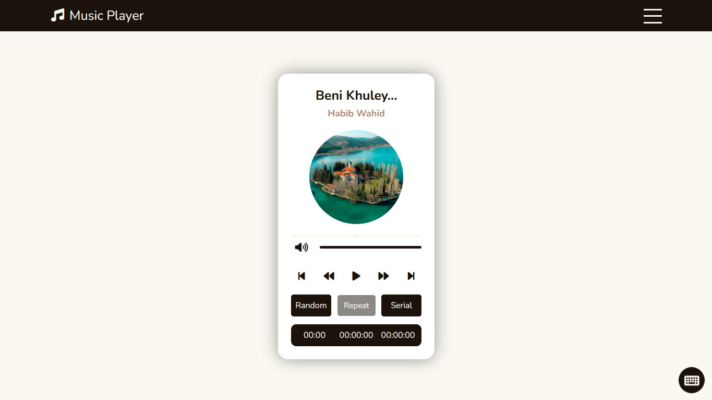
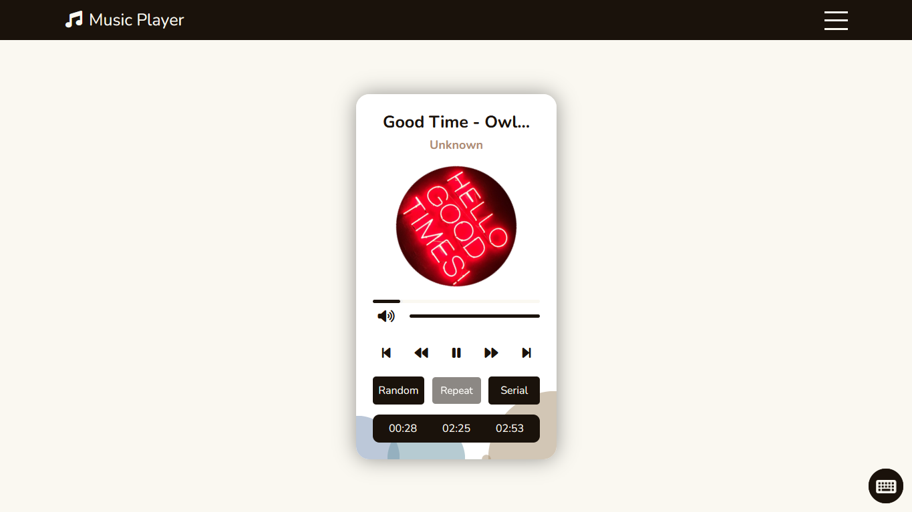
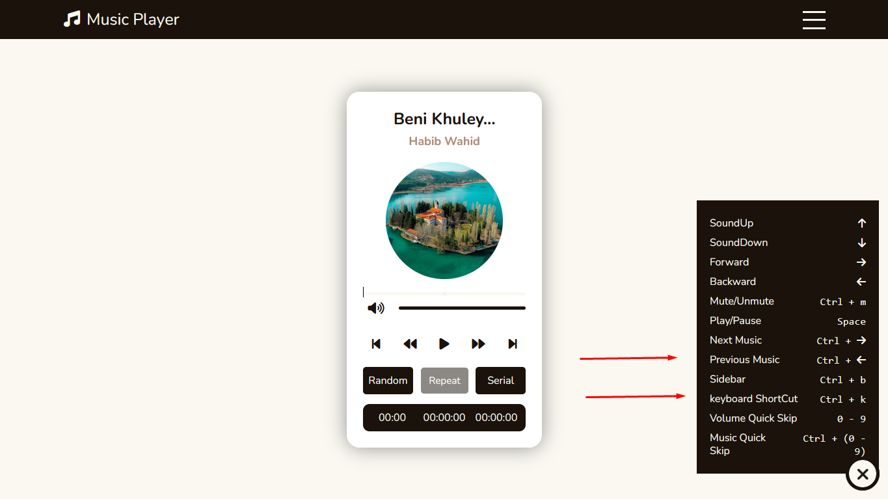
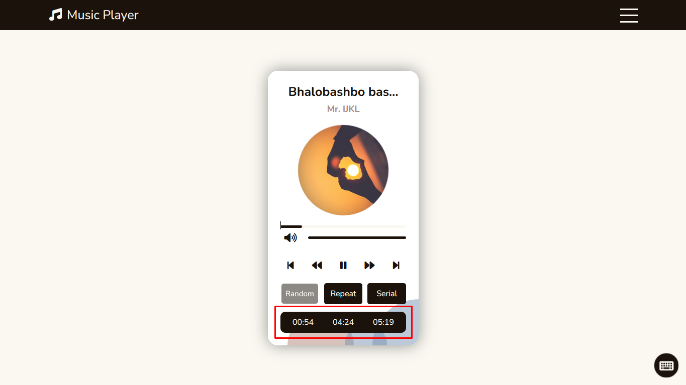
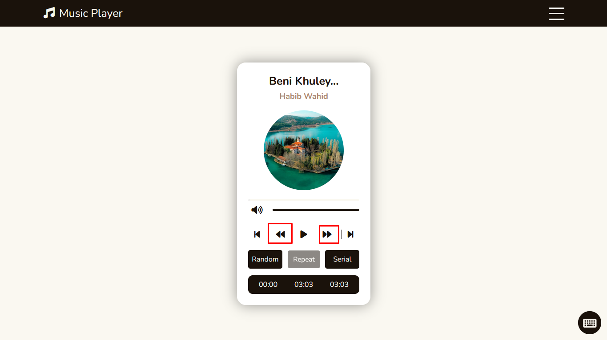
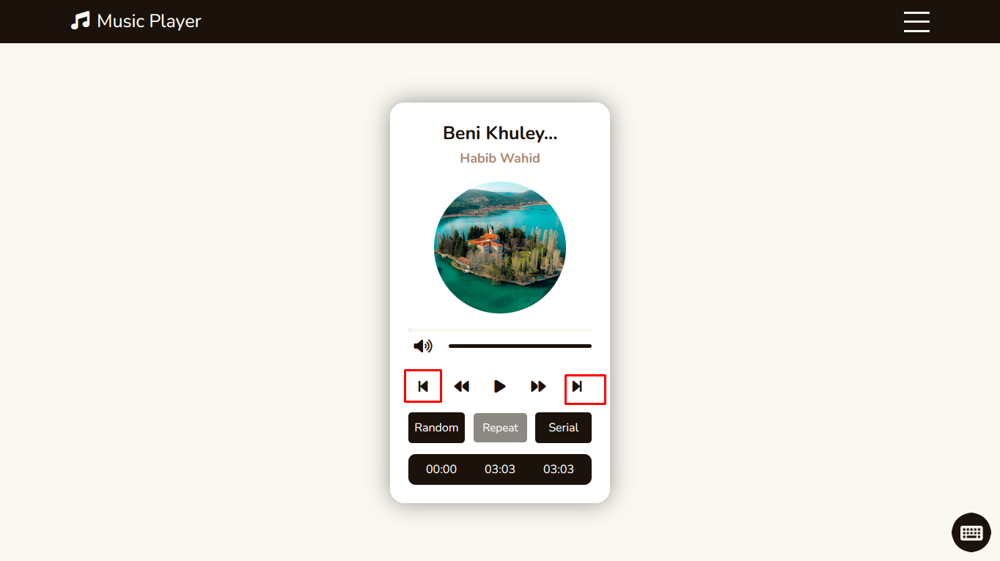
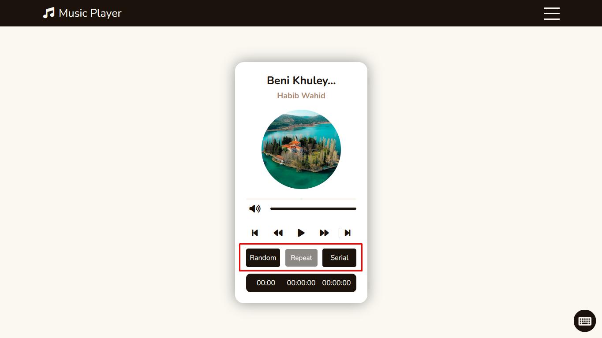
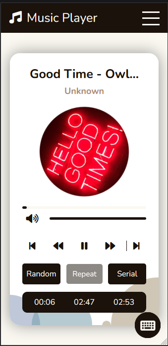
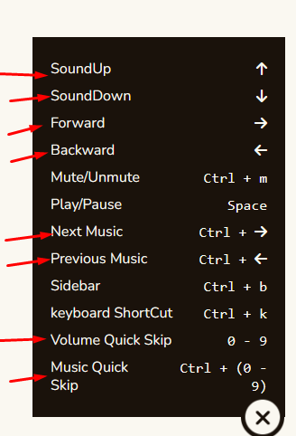

# music_player_v1

# Live Preview: 

[Live preview](https://developerHub01.github.io/music_player_v1/ "Live Preview App"): https://developerHub01.io/music_player_v1/
----------------------------------------------------

# First Look: 

------------------

# When Music is on: 

------------------

# Short_cuts: 

------------------

# Menubar: 

------------------

# Time: 

------------------

# Current Time | Remain Time | Duration: 

------------------

# Backward Forward: 

------------------

# Previous Next: 

------------------

# Flow Style: 

------------------

# Phone View: 

------------------

# ShortCut List: 

------------------

